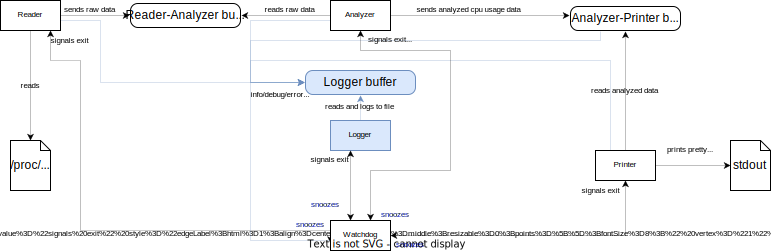
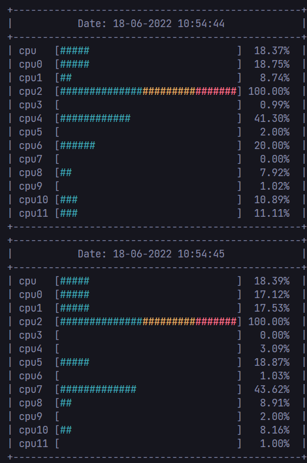
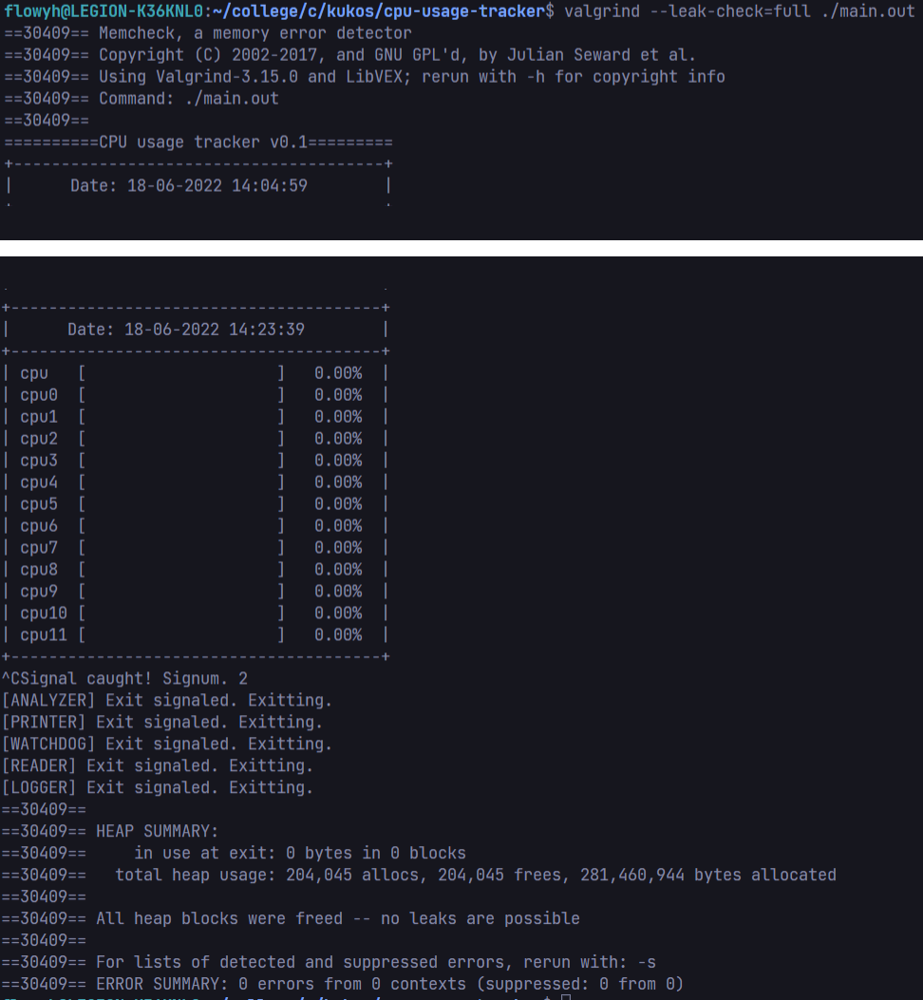

## CPU usage tracker with multiple threads

A recruitment task for [Tietoevry](https://www.tietoevry.com/).
Simple /proc/stat reader with multiple worker threads.

_Author: Maciej Bazela [@Flowyh](https://github.com/Flowyh)_

### Usage:

Compile with:

```sh
$ make
$ make MODE=test # compile tests
```

Run with:

```sh
$ ./main.out # run main app
$ ./test/test.out # run tests
```

### About the task:

This is an implementation of a recruitment task for [Tietoevry](https://www.tietoevry.com/).

My job was to implement a _simple_ console application which tracks current CPU usage.

Everything were supposed to run on 5 different threads:

- Reader - read **/proc/stat** and sends raw data to Analyzer,
- Analyzer - analyzes raw data from Reader, calculates CPU usage percentage and sends it to Printer,
- Printer - prints analyzed data to the console,
- Logger - accepts message logs from each thread and saves them to a .log file,
- Watchdog - watches every thread, checks if any froze and sends exit signal to each thread if needed.

Additionally:

- everything has to be written in C (std=c99 or newer),
- there should be no compilation warnings (clang -Weverything, gcc -Wall -Wextra),
- application should be built based on a Makefile with dynamic compiler changes (reading CC= var),
- a version control system with "pretty" commit history should be present,
- app should work on any linux distro,
- there should be no memory leaks (valgrind),
- SIGTERM signal should be caught in order to gently deallocate used memory, close threads, close log file descriptor and exit.

### My implementation:

#### Threads communication


_Sketch 1. Application threads diagram._

My main idea was to separate communication between threads into several data-race free buffers. To achieve that I've implemented a ring-buffer which utilizes **pthread cond vars** as a way of signaling empty/full buffer states (so essentially it's a monitor):

```c
struct PCPBuffer
{
  size_t packet_size; // Buffer packet size in bytes
  size_t packet_limit; // Maximum number of packets in buffer
  size_t current_packets; // Current number of stored buffers
  size_t head; // Current buffer head
  size_t tail; // Current buffer tail
  pthread_mutex_t mutex; // Buffer lock
  pthread_cond_t can_produce; // Signal to continue producing
  pthread_cond_t can_consume; // Signal to continue consuming
  uint8_t buffer[]; // Flexible array member
};
```

There are 3 different buffers and therefore 3 kinds of packets:

- Reader-Analyzer buffer - stores data read from /proc/stat as raw bytes,
- Analyzer-Printer buffer - stores data analyzed from /proc/stat raw bytes as _core_name_: _usage%_ pairs:

```c
typedef struct AnalyzerPacket {
  char core_name[CORE_NAME_LENGTH];
  double cpu_percentage;
} AnalyzerPacket;
```

- Logger buffer - stores info messages sent from each thread as 1024-bytes messages.

Implementation of each thread communication mechanism is simple. Each thread can be a producer, a consumer or both.

- Reader is a producer for Reader-Analyzer buffer,
- Analyzer is a consumer for Reader-Analyzer buffer and a producer for Analyzer-Printer buffer,
- Printer is a consumer for Analyzer-Printer buffer,
- each thread is a producer for Logger buffer,
- Logger is a consumer for Logger buffer.

Producer's job go as follow:

```
1. Create a product.
2. Walk into the warehouse (lock buffer).
3. If warehouse is full (buffer is full):
  3.1. Wait until consumer has consumed a product from the warehouse (consumer took the packet from the buffer).
4. Put created product into the warehouse (send packet into the buffer).
5. Signal consumer. Now it can consume this new product.
6. Leave the warehouse (unlock buffer).
```

Consumer's job is pretty simillar:

```
1. Walk into the warehouse (lock buffer).
2. If warehouse is empty (buffer is empty):
  2.1. Wait until producer has produced a product (producer sent a packet into the buffer).
3. Consume the product (get packet from the buffer).
4. Signal producer. Now it can produce new products.
5. Leave the warehouse (unlock buffer).
```

In order to keep everything smooth each job should be done quickly enough to avoid bottlenecks.

We should only get or put a packet from buffers during this process. Other tasks such as analyzing consumed data should be done **OUTSIDE** the consumers/producers jobs.

Each thread communication logic can be found in [./src/thread_routines.c](./src/thread_routines.c) in respective threadname_thread functions.

#### Watchdog

Each application thread has to create it's own Watchdog object and register it in global WatchdogPack object:

```c
struct Watchdog
{
  pthread_mutex_t exit_flag_mutex;
  struct timespec alarm_clock;
  pthread_t id;
  double limit;
  bool exit_flag;
  const char* name;
};
[...]
struct WatchdogPack
{
  size_t size;
  size_t registered;
  Watchdog* restrict pack[]; // FAM
};
```

A Watchdog is a simple structure which holds a certain point in time, expiration limit (in seconds), thread id, a name and an exit flag boolean + it's mutex.

Watchdog thread will try to check if enough time has expired for any Watchdog to go beyond expiration limit (to bark):

```c
int watchdog_is_alarm_expired(register const Watchdog* restrict const wdog)
{
  if (wdog == NULL)
    return -1;

  struct timespec now;
  clock_gettime(CLOCK_MONOTONIC, &now);
  double diff = timespec_to_seconds(now) - timespec_to_seconds(wdog->alarm_clock);
  return (diff) >= wdog->limit;
}
```

If so, Watchdog thread will enable exit flag booleans in each threads' Watchdog.

In order to keep the app running, a thread with a Watchdog has to change the remembered Watchdog time (snooze it):

```c
void watchdog_snooze(Watchdog* restrict wdog) {
  if (wdog == NULL)
    return; // Dog doesn't exist

  register const pthread_t self_id = pthread_self();
  if (wdog->id != self_id)
    return; // Snoozing wrong dog

  (void) clock_gettime(CLOCK_MONOTONIC, &wdog->alarm_clock);
}
```

If it's successful, Watchdog thread will not enable any exit flag.

This implementation is data-race free, because each thread has it's own exit flag (with a mutex) and a Watchdog to snooze.

#### Exit signal

Exitting from the app is also pretty simple. All threads have their own Watchdogs. Each watchdog has an exit flag which is set to **false** if the app has to be running and to **true** if the app has to stop.

Each thread checks the value of it's own boolean. If it's **true**, it breaks it's task loop and deallocates used memory.

After each thread has stopped it's loop the main program deallocates buffers and other global variables.

#### Logging

Execution logs are saved in ./log folder (which is created if it doesn't exist). Each log file has application start time in it's name (e.g: _cpu_usage_tracker_18-06-2022 13:07:29.log_).

```log
[INFO][18-06-2022 13:08:03][PRINTER] Creating watchdog.
[INFO][18-06-2022 13:08:03][PRINTER] Registering watchdog.
[INFO][18-06-2022 13:08:03][PRINTER] Reading from buffer.
[INFO][18-06-2022 13:08:03][PRINTER] Buffer is empty, waiting for producer.
[INFO][18-06-2022 13:08:03][ANALYZER] Creating watchdog.
[INFO][18-06-2022 13:08:03][ANALYZER] Registering watchdog.
[INFO][18-06-2022 13:08:03][ANALYZER] Reading from buffer.
[INFO][18-06-2022 13:08:03][ANALYZER] Buffer is empty, waiting for producer.
[INFO][18-06-2022 13:08:03][READER] Creating watchdog.
[INFO][18-06-2022 13:08:03][READER] Registering watchdog.
[INFO][18-06-2022 13:08:03][READER] Reading from file.
[INFO][18-06-2022 13:08:03][READER] Sending packet.
[INFO][18-06-2022 13:08:03][ANALYZER] Producer signaled. Continuing.
[INFO][18-06-2022 13:08:03][ANALYZER] Acquiring packet.
[INFO][18-06-2022 13:08:03][ANALYZER] Sending to next buffer.
[INFO][18-06-2022 13:08:03][ANALYZER] Sending packet.
[INFO][18-06-2022 13:08:03][ANALYZER] Reading from buffer.
[INFO][18-06-2022 13:08:03][ANALYZER] Buffer is empty, waiting for producer.
[INFO][18-06-2022 13:08:03][PRINTER] Producer signaled. Continuing.
[INFO][18-06-2022 13:08:03][PRINTER] Acquiring packet.
[INFO][18-06-2022 13:08:04][READER] Reading from file.
[INFO][18-06-2022 13:08:04][READER] Sending packet.
[...]
```

#### Printing to the console

During the exeuction of the program Printer prints a nicely formatted data into the stdout:


_Sketch 2. Example console output._

Each frame is printed in 1 second intervals.
Core usages are separated into lines consisting of:

- core name (first line "cpu" is total cpu usage percentage),
- usage histogram (green area is <50% core usage, yellow <80% core usage, red >80% core usage)
- core usage in %

CPU usage is calculated using this [formula](https://stackoverflow.com/a/23376195/18870209).

#### Valgrind

After ~20 mintues of execution my laptop is still alive and there are no memory leaks or errors:


_Sketch 3. Valgrind check._
